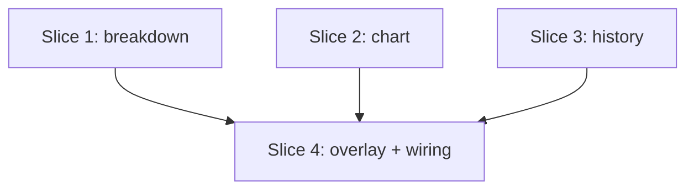

# Plan: `/dev-team usage` — graphical GitHub Copilot AI credits view

**Created**: 2026-10-04
**Branch**: main (build on new branch `dev-team-usage`)
**Status**: implemented
**Gherkin persistence**: plan-file-only

## Goal

Give pi-dev-team users a `/dev-team usage` subcommand that opens a graphical TUI overlay showing where their GitHub Copilot AI credits went: horizontal bar charts of credits by model and by dev-team agent, plus a stacked split of main thread vs subagents vs overhead. It defaults to the current session and can switch to this calendar month across all saved pi sessions (the period GitHub bills Copilot in). Today the only signal is one number on the status line; users cannot tell which models or agents dominate spend. pi 1.0.2 has no `/usage` command (built-ins checked in `dist/core/slash-commands.js`); `/session` shows text stats only, and extensions cannot extend built-in commands, so this lives under `/dev-team`.

## Approach stances (decision-defaults axes)

- **Scope**: GitHub Copilot AI credits only (USD × 100, same formula as the status line). Non-Copilot spend is excluded everywhere. No USD charts, no monthly allowance, no GitHub billing API.
- **Replace vs merge**: additive, with one deliberate change to shared accounting: `sessionSpend()` now also yields compaction and branch-summary usage (attributed to the model in effect), so the status line counts them too. The cost meter skips overhead and is unchanged; subagent render unchanged.
- **History source**: stat-only walk of the pi session root, top-level session files only (`<root>/<project>/*.jsonl` or a flat `<root>/*.jsonl`). Nested `run-N/session.jsonl` files from another extension are ignored for now (operator decision 2026-10-04; those subagents will be fixed separately). Covers all projects — credits are account-wide.
- **History window**: this calendar month only, from the 1st at 00:00 UTC (GitHub's monthly reset; confirm against GitHub's billing docs in step 3.1). No other windows.
- **Credits label**: plain "AI credits", no "estimate" — tokens × GitHub's per-token rates ÷ $0.01 is exact by formula, and compaction is now counted.
- **Integration**: PR with review gate (default).

## Verified facts (spikes, 2026-10-04)

- Fork/clone keep entry `id` + `timestamp`: `SessionManager.forkFrom` copies entries verbatim, `createBranchedSession` spreads them (`session-manager.js:1205`, `:1374`). Dedupe on `id|timestamp` is sound.
- `SessionManager.listAll()` = 33 files in 116 ms. `~/.pi/agent/sessions` also holds 60 nested `run-N/session.jsonl` from another subagent extension: 737 Copilot turns, $48.20 = 4,820 AI credits, all Aug–Sep 2026 (none in October). Ignored for now by operator decision.
- Compaction and branch-summary entries carry `usage` but no provider/model (`docs/session-format.md`); pi summarizes with the session's current model, so the last `model_change` or assistant model before the entry identifies it.
- pi-dev-team's own children run `--no-session` (`subagent.ts:297`), so they write no files; their spend lives in the parent's `SUBAGENT_USAGE_ENTRY` entries. No double count.
- RPC mode: `hasUI` is true but `ui.custom()` is a stub resolving `undefined` without calling the factory (`rpc-mode.js:152`).
- `tui.terminal.rows` gives the terminal height for fitting rows; `OverlayOptions.maxHeight` caps the overlay.

## Glossary (UI terms, used consistently)

| Term | Meaning |
|---|---|
| AI credits | Copilot billing unit, 1 = $0.01 |
| This session | Entries of the open session, every branch (same as status line) |
| This month | Every top-level saved pi session file, all projects, entries since the 1st 00:00 UTC |
| Main | The session's own assistant turns |
| Subagents | dev-team dispatched agents, nested included |
| Overhead | Spend outside a turn: cache warm-ups, compaction, branch summaries |

## Acceptance Criteria

- [ ] `/dev-team usage` opens an overlay with block-character bar charts of Copilot AI credits.
- [ ] "By model" ranks models by credits, largest first; each row shows model, credits, share %.
- [ ] "By agent" ranks subagents by credits; share % is of the subagent total.
- [ ] Every non-empty view shows a split bar with one segment per non-zero thread (main █, subagents ▓, overhead ░) and a legend naming each with its credits; zero threads are omitted.
- [ ] Header always states scope (with dates for this month), view and total in AI credits.
- [ ] Keys: `Tab`/`Shift+Tab` view; `s` this session ↔ this month; `Esc`/`q`/`Ctrl+C` close. Letter keys case-insensitive. Footer: ready → `Tab view · s <other scope> · Esc close`; loading → `Tab view · s cancel · Esc close`; error → `s back · Esc close`.
- [ ] This month aggregates entries timestamped since the 1st 00:00 UTC from every top-level session file; nested run files ignored; forked/cloned entries count once.
- [ ] Compaction and branch-summary usage counts as overhead at the model in effect, in the overlay and the status line.
- [ ] Loading shows progress (`n/N files`); `s` cancels and returns; closing cancels.
- [ ] A failed history load shows "Could not load history: <reason>" and stays usable.
- [ ] Empty states: "No GitHub Copilot usage in <scope>" (with "press s for this month" in session scope); "No subagent usage in <scope>" in By agent.
- [ ] No overlay line exceeds terminal width; overlay never exceeds terminal height (rows fold into "other (N)"; header/footer pinned).
- [ ] When the overlay cannot show (no UI, or RPC where `custom()` is a stub) a plain-text summary is printed: header line, split line, then models and agents ranked with credits and share; `/dev-team usage [session|month]` selects scope in both modes.
- [ ] README documents the subcommand, keys, args, and that nested run files of other extensions are not counted.

## Slices

### Slice 1: Credits breakdown and formatting (pure)

**Depends-on:** none
**Files:** `extensions/dev-team/lib/usage-breakdown.ts`, `extensions/dev-team/lib/ai-credits.ts`, `extensions/dev-team/lib/session-spend.ts`, `test/unit/usage-breakdown.test.ts`, `test/unit/ai-credits.test.ts`, `test/unit/session-spend.test.ts`, `README.md`

**Behavior:**

```gherkin
Feature: AI credits breakdown

  Scenario: Credits are grouped by model, largest first
    Given Copilot runs on model A costing $0.30 and $0.20, and on model B costing $0.10
    When the breakdown is computed
    Then the model ranking is A with 50 credits then B with 10 credits
    And the total is 60 credits
    And the shares are 83.3% and 16.7%

  Scenario: Credits are grouped by subagent
    Given a dev-team run by "orchestrator" and a nested run by "Explore", both on Copilot
    When the breakdown is computed
    Then the agent ranking lists "orchestrator" and "Explore" with their own credits
    And main-thread turns are not listed as an agent

  Scenario: Thread split covers main, subagents and overhead
    Given Copilot spend on a main turn, a subagent run and a cache warm-up
    When the breakdown is computed
    Then the split reports each thread's credits and they sum to the total

  Scenario: Non-Copilot runs are excluded
    Given one Copilot run and one run served by another provider
    When the breakdown is computed
    Then only the Copilot run appears in any ranking or total

  Scenario: Ties are ordered by name
    Given two models with identical credits
    When the breakdown is computed
    Then they are ordered alphabetically

  Scenario: No Copilot spend
    Given no runs, or only non-Copilot runs
    When the breakdown is computed
    Then the total is 0, every ranking is empty, and no share is computed

  Scenario: Tiny share
    Given a row whose share is below 1%
    When the breakdown is computed
    Then its share displays as "<1%"

  Scenario: Bare credits formatting
    Given 1234.5 credits
    When formatted without the unit
    Then it reads "1,235", and with the unit "1,235 AI credits" as before

  Scenario: Compaction is counted at the model in effect
    Given a session on Copilot model A that compacts with usage costing $0.05
    When spend is computed
    Then the compaction counts 5 credits as overhead named "compaction" on model A
    And the status line total includes it

  Scenario: Model switch before compaction
    Given a session that switches from model A to model B, then compacts
    When spend is computed
    Then the compaction is attributed to model B

  Scenario: Branch summary is counted
    Given a branch summary with usage on a Copilot session
    When spend is computed
    Then it counts as overhead named "branch summary"

  Scenario: Compaction before any model is known
    Given a compaction entry with usage and no earlier model
    When spend is computed
    Then it is attributed to model "unknown" and counts no AI credits

  Scenario: Cost meter unchanged
    Given a session with compaction usage
    When the cost meter row is built
    Then it equals the row without compaction support
```

**Steps:**

#### Step 1.1: Shared credits conversion and bare formatter

**Complexity**: standard
**IMPLEMENT**: Export `runCredits(run)` (one run's Copilot credits, 0 otherwise) and `formatCredits(n)` (bare number, existing digit tiers) from `ai-credits.ts`; `formatAiCredits` = `formatCredits` + " AI credits"; `runsAiCredits` sums `runCredits`. Signatures of existing exports unchanged.
**TEST**: Bare-format scenario; existing `ai-credits.test.ts` stays green unchanged.
**REFACTOR**: Remove the now-duplicate USD×100 multiplication.
**Files**: `extensions/dev-team/lib/ai-credits.ts`, `test/unit/ai-credits.test.ts`
**Commit**: `Expose per-run AI credits and a bare credits formatter`

#### Step 1.2: Group Copilot runs by model, agent and thread

**Complexity**: standard
**IMPLEMENT**: `usageBreakdown(runs: Iterable<SpendRun>)` → `{ total, byModel, byAgent, byThread }`; rows `{ label, credits, share }` sorted credits desc then label asc; credits kept as floats, rounded only at display; `total` = sum of rows; `byAgent` from `thread === "subagent"` with share of the agent total; `formatShare(share)` → one decimal, `<1%` below 1, no division when total is 0.
**TEST**: Scenarios 1–7 (float comparisons via formatted strings or tolerance); full suite green.
**REFACTOR**: One `rank(map)` helper shared by the three groupings.
**Files**: `extensions/dev-team/lib/usage-breakdown.ts`, `test/unit/usage-breakdown.test.ts`
**Commit**: `Group Copilot AI credits by model, agent and thread`

#### Step 1.3: Count compaction and branch summaries at the model in effect

**Complexity**: standard
**IMPLEMENT**: `sessionSpend()` tracks the model in effect (last `model_change` `provider/modelId`, or last assistant `provider/model`, in entry order) and yields `compaction` / `branch_summary` entries with `usage` as `thread: "overhead"`, agent `"compaction"` / `"branch summary"`. Update the module doc comment and README (status line now includes compaction).
**TEST**: Compaction scenarios 9–13 in `session-spend.test.ts`; existing `metrics.test.ts` and `ai-credits.test.ts` green.
**REFACTOR**: Small `modelInEffect` tracker kept local to the generator.
**Files**: `extensions/dev-team/lib/session-spend.ts`, `test/unit/session-spend.test.ts`, `README.md`
**Commit**: `Count compaction and branch-summary usage at the model in effect`

### Slice 2: Bar chart rendering (pure, width-safe)

**Depends-on:** none
**Files:** `extensions/dev-team/lib/usage-chart.ts`, `test/unit/usage-chart.test.ts`

**Behavior:**

```gherkin
Feature: Bar chart lines

  Scenario: Bars scale to the largest row
    Given rows A=50 and B=10 and a bar area of 10 cells
    When the chart is rendered
    Then A's bar is "██████████" and B's bar is "██"
    And each line shows the label, the formatted value and the share

  Scenario: Fractional bar lengths use eighth blocks
    Given a row at 0.55 of the largest and a bar area of 10 cells
    When the chart is rendered
    Then its bar is "█████▌"

  Scenario: A non-zero row is always visible
    Given a row at 0.001 of the largest
    When the chart is rendered
    Then its bar is "▏"

  Scenario: Wide terminal keeps the full label
    Given a width of 80 columns and a 40-character label
    When the chart is rendered
    Then the label is intact and the line fits 80 columns

  Scenario: Narrow terminal truncates the label first
    Given a width of 30 columns and a 40-character label
    When the chart is rendered
    Then the label ends in an ellipsis and bar, value and share are still shown
    And no line is wider than 30 columns

  Scenario: Very narrow terminal degrades in a fixed order
    Given a width of 10 columns
    When the chart is rendered
    Then share is dropped first, then the bar, leaving label and value
    And no line is wider than 10 columns

  Scenario: Rows beyond the limit fold into "other"
    Given 10 rows and a row limit of 8
    When the chart is rendered
    Then 7 rows are shown, then "other (3)" carrying the summed value and share

  Scenario: Exactly the row limit
    Given 8 rows and a row limit of 8
    When the chart is rendered
    Then all 8 rows are shown with no "other" row

  Scenario: Stacked split bar
    Given main=30, subagents=60, overhead=10 and a bar area of 10 cells
    When the split bar is rendered
    Then the bar is "███▓▓▓▓▓▓░" and the legend reads "█ main 30 · ▓ subagents 60 · ░ overhead 10"

  Scenario: Zero thread omitted
    Given main=40, subagents=0, overhead=10
    When the split bar is rendered
    Then the bar and legend show only main and overhead

  Scenario: Uneven split fills the bar exactly
    Given main=1, subagents=1, overhead=1 and a bar area of 10 cells
    When the split bar is rendered
    Then the bar is exactly 10 cells, allocated by largest remainder

  Scenario: Tiny part stays visible
    Given main=99, subagents=0, overhead=1 and a bar area of 10 cells
    When the split bar is rendered
    Then the bar is 10 cells and overhead occupies at least one cell

  Scenario: Narrow split legend
    Given a width of 30 columns
    When the split bar is rendered
    Then no line is wider than 30 columns
```

**Steps:**

#### Step 2.1: Ranked horizontal bars

**Complexity**: standard
**IMPLEMENT**: `barChartLines(rows, { width, maxRows, formatValue, style })` — label column, `█` + eighth-block bar, value, share; `formatValue` and `style` injected so the chart imports nothing from slice 1; widths via pi-tui `visibleWidth`/`truncateToWidth` (confirm pi-tui resolves under `node --test` first).
**TEST**: Scenarios 1–8 with identity style and exact strings, per-width assertions; if pi-tui does not resolve under `node --test`, inject `visibleWidth`/`truncate` like `style`; full suite green.
**REFACTOR**: Named layout constants; extract cell-allocation helper.
**Files**: `extensions/dev-team/lib/usage-chart.ts`, `test/unit/usage-chart.test.ts`
**Commit**: `Render ranked AI credits as width-safe bar chart lines`

#### Step 2.2: Stacked thread split bar

**Complexity**: standard
**IMPLEMENT**: `splitBarLines(parts, { width, formatValue, style })` — glyphs `█ ▓ ░` per segment plus colour; legend wraps or truncates to width; zero parts omitted.
**TEST**: Split-bar scenarios (exact, zero, uneven, tiny, narrow); full suite green.
**REFACTOR**: Reuse the 2.1 cell-allocation helper.
**Files**: `extensions/dev-team/lib/usage-chart.ts`, `test/unit/usage-chart.test.ts`
**Commit**: `Add the main/subagents/overhead split bar`

### Slice 3: This-month loader across saved sessions

**Depends-on:** none
**Files:** `extensions/dev-team/lib/usage-history.ts`, `test/unit/usage-history.test.ts`

**Behavior:**

```gherkin
Feature: Usage history from saved sessions

  Scenario: Spend is collected from every top-level session file
    Given two session files in different project folders and one flat session file
    When this month is loaded
    Then spend records from all three files are returned with their timestamps

  Scenario: Nested run files are ignored
    Given a nested "run-0/session.jsonl" file with Copilot spend this month
    When this month is loaded
    Then none of its spend is returned

  Scenario: Month start
    Given now is 2026-10-04 15:00 UTC
    When the month start is computed
    Then it is 2026-10-01 00:00 UTC

  Scenario: First day of the month
    Given now is 2026-11-01 00:30 UTC
    When the month start is computed
    Then it is 2026-11-01 00:00 UTC and last month's entries are excluded

  Scenario: Boundary entries
    Given entries exactly at the month start and 1 ms before it
    When history is loaded
    Then only the entry at the start is returned

  Scenario: Old files are skipped
    Given a file last modified before the month start whose content is invalid
    When history is loaded
    Then it yields no records and is not counted as skipped

  Scenario: Forked and cloned sessions count once
    Given a session and its fork both containing an entry with the same id and timestamp
    When history is loaded
    Then that entry's spend is returned once

  Scenario: Same id, different timestamp
    Given two entries sharing an id but with different timestamps
    When history is loaded
    Then both are returned

  Scenario: Malformed lines are tolerated
    Given a file with a truncated last line and a non-JSON line
    When history is loaded
    Then valid entries are returned and bad lines are ignored

  Scenario: Unreadable file
    Given one file that cannot be read
    When history is loaded
    Then the other files are returned and skipped is 1

  Scenario: No session files
    Given an empty or missing session root
    When history is loaded
    Then no records are returned and no error is raised

  Scenario: Progress
    Given 3 files modified this month
    When history is loaded
    Then progress is reported as 1/3, 2/3, 3/3

  Scenario: Cancelled load
    Given a load in progress
    When the abort signal fires
    Then loading stops between files and resolves as aborted
```

**Steps:**

#### Step 3.1: Walk, month-filter and read session files

**Complexity**: standard
**IMPLEMENT**: Result type `{ records: { timestamp, run: SpendRun }[], skipped, aborted }` defined up front. `sessionRoot(sessionDir)` (parent when basename is `--…--`, else itself); `monthStart(now)` (1st 00:00 UTC; confirm GitHub's reset time in its billing docs first and record the source in a comment); `loadUsageHistory({ root, since, signal, onProgress })` — `*.jsonl` at depth ≤ 2 under root only, `stat` mtime pre-filter, line parse, each file's entries fed through `sessionSpend()` in order (so compaction model tracking sees earlier entries), then records with `timestamp >= since` kept.
**TEST**: Scenarios 1–5, 8–11 with temp dirs, plus entries with missing/invalid timestamp ignored, flat-root fixture; `now` injected; full suite green.
**REFACTOR**: Isolate line parsing from file iteration.
**Files**: `extensions/dev-team/lib/usage-history.ts`, `test/unit/usage-history.test.ts`
**Commit**: `Load this month's AI credits from every saved pi session`

#### Step 3.2: De-duplicate shared entries and support abort

**Complexity**: standard
**IMPLEMENT**: Dedupe key `id|timestamp` across files; `signal.aborted` checked between files.
**TEST**: Scenarios 6, 7, 12; full suite green.
**REFACTOR**: Name the dedupe key helper.
**Files**: `extensions/dev-team/lib/usage-history.ts`, `test/unit/usage-history.test.ts`
**Commit**: `Count entries shared by forked sessions once`

### Slice 4: `/dev-team usage` overlay, text fallback and wiring

**Depends-on:** 1, 2, 3
**Files:** `extensions/dev-team/lib/usage-state.ts`, `extensions/dev-team/lib/usage-view.ts`, `extensions/dev-team/lib/usage-text.ts`, `extensions/dev-team/lib/usage-command.ts`, `extensions/dev-team/index.ts`, `test/unit/usage-state.test.ts`, `test/unit/usage-view.test.ts`, `test/unit/usage-text.test.ts`, `test/unit/usage-command.test.ts`, `test/e2e/run.mjs`, `README.md`

**Behavior:**

```gherkin
Feature: Usage overlay

  Scenario: Opening shows this session by model
    Given a session with Copilot spend
    When the user runs "/dev-team usage"
    Then the header reads "This session · By model · <total> AI credits"
    And the split bar and the by-model chart are shown
    And the footer lists "Tab view · s this month · Esc close"

  Scenario: Switching views keeps the split bar
    Given the overlay is open on By model
    When the user presses Tab
    Then the by-agent chart is shown and the split bar is still shown
    And Shift+Tab returns to By model

  Scenario: Switching to this month
    Given the overlay shows this session
    When the user presses "s"
    Then the chart area reads "Reading sessions… n/N files · s cancel · Esc close"
    And then the header reads "This month (Oct 1 – Oct 4) · By model · <total> AI credits · as of 14:05"

  Scenario: Back to this session cancels a load
    Given a this-month load in progress
    When the user presses "s"
    Then the load is cancelled and this session's chart is shown

  Scenario: View persists across scope toggles
    Given the overlay is on By agent for this session
    When the user presses "s" and the load completes
    Then the this-month chart is on By agent

  Scenario: History load fails
    Given reading the session root throws "EACCES"
    When the user presses "s"
    Then the overlay shows "Could not load history: EACCES · s back"
    And pressing "s" returns to this session

  Scenario: Skipped files footnote
    Given 2 session files could not be read
    When this month renders
    Then a muted footnote reads "2 session files could not be read"

  Scenario: Empty session
    Given no Copilot spend in this session
    When the overlay renders
    Then it reads "No GitHub Copilot usage in this session — press s for this month"
    And no split bar is shown

  Scenario: Empty month
    Given no Copilot spend this month
    When the overlay renders
    Then it reads "No GitHub Copilot usage this month"

  Scenario: Keys while loading
    Given a this-month load in progress
    When the user presses Tab
    Then the view changes and the chart area keeps the loading line

  Scenario: Snapshot time
    Given this month loaded at 14:05
    When the overlay renders
    Then the header ends "as of 14:05" and reopening the overlay is the refresh path

  Scenario: Main-only spend in By agent
    Given Copilot spend on main turns only
    When the user switches to By agent
    Then it reads "No subagent usage in this session"
    And the split bar is still shown

  Scenario: Overlay fits narrow and short terminals
    Given any scope, view and state
    When rendered at 10, 30 and 80 columns and 12 and 40 rows
    Then no line exceeds the width, the line count fits the height, and header and footer are present
    And truncation drops the dates and "as of" before scope and view, and the footer always keeps "Esc close"

  Scenario: Close keys
    Given the overlay is open
    When the user presses Esc, q, Q or Ctrl+C
    Then the overlay closes

  Scenario: Unrelated keys are ignored
    Given the overlay is open
    When the user presses "x"
    Then nothing changes

  Scenario: No interactive overlay
    Given pi runs in print mode, or in RPC mode where the overlay is not shown
    When "/dev-team usage" runs
    Then a plain-text summary is printed: total, split, top models, top agents

  Scenario: No interactive overlay and no spend
    Given print mode and no Copilot spend in this session
    When "/dev-team usage" runs
    Then it prints "No GitHub Copilot usage in this session"

  Scenario: No interactive overlay, history load fails
    Given print mode and reading the session root throws "EACCES"
    When "/dev-team usage month" runs
    Then it prints "Could not load history: EACCES" and does not throw

  Scenario: Overlay shown normally prints no text
    Given the overlay opened and was closed
    When "/dev-team usage" finishes
    Then no plain-text summary is printed

  Scenario: Argument selects scope
    Given "/dev-team usage month"
    When it runs in either mode
    Then it starts on this month

  Scenario: Unknown argument
    Given "/dev-team usage histroy"
    When it runs
    Then it reports "Usage: /dev-team usage [session|month]" and opens nothing

  Scenario: Discoverability
    Given the user types "/dev-team "
    When completions are shown
    Then "usage" is offered
```

**Steps:**

#### Step 4.1: Pure state reducer

**Complexity**: standard
**IMPLEMENT**: `usage-state.ts`: state `{ scope, view, load: idle|loading(n/N)|ready|error }`, `reduce(state, action)` for keys and load events; key mapping case-insensitive; `parseUsageArgs(args)` → initial state or usage error.
**TEST**: View/scope transitions, Tab while loading, uppercase `S`/`Q`, re-pressing `s` (completed load reused, cancelled load restarts), `s` during load cancels, view persists across toggles, close keys, unrelated key, arg parsing incl. unknown; full suite green.
**REFACTOR**: Table-driven key map.
**Files**: `extensions/dev-team/lib/usage-state.ts`, `test/unit/usage-state.test.ts`
**Commit**: `Add the usage overlay state machine`

#### Step 4.2: Overlay component rendering

**Complexity**: standard
**IMPLEMENT**: `usage-view.ts`: component `render(width)` composing header, split bar, chart (`maxRows` from `tui.terminal.rows` minus pinned lines), footnote, state-aware footer; empty/error/loading states; both scopes feed `sessionSpend()` → `usageBreakdown()` (session: `sessionEntries(ctx)`, month: loaded records); `invalidate()` clears caches.
**TEST**: Exact header/footer strings (incl. `as of HH:MM`, injected clock), header/footer truncation priority, bar present (`█`), empty and By-agent-empty messages, error message, footnote, width/height invariant across all states at 10/30/80 cols × 12/40 rows; full suite green.
**REFACTOR**: Single `layout(height)` deciding pinned vs flexible lines.
**Files**: `extensions/dev-team/lib/usage-view.ts`, `test/unit/usage-view.test.ts`
**Commit**: `Render the AI credits usage overlay`

#### Step 4.3: Load orchestration and cancel

**Complexity**: standard
**IMPLEMENT**: This-month load runs once per open, `onProgress` → loading state, `AbortController` aborted on close or `s`; loader rejection → error state.
**TEST**: Stub loader: progress, success, rejection, cancel via `s`, cancel on close, second `s` after success reuses records; full suite green.
**REFACTOR**: One `startLoad()` path.
**Files**: `extensions/dev-team/lib/usage-view.ts`, `test/unit/usage-view.test.ts`
**Commit**: `Load this month once per open, with progress and cancel`

#### Step 4.4: Text summary, command wiring, docs

**Complexity**: standard
**IMPLEMENT**: `usage-text.ts`: plain ranked summary. `usage-command.ts`: `runUsage(ctx, args, deps)` — parse args; if `hasUI`, `ui.custom(..., { overlay: true, overlayOptions: { maxHeight: "90%" } })` and track whether the factory ran; if not (RPC stub) or `!hasUI`, emit text via `notify`/`console.log`. `index.ts`: add `usage` to subcommands, completions and description (2-line branch). README section: keys, args, glossary of "overhead"/"subagents", nested run files of other extensions not counted.
**TEST**: Text formatter with seeded runs (ranked) and empty; `runUsage` with stub ui whose `custom` resolves without calling the factory → text emitted; factory called → no text; no UI → text emitted; rejecting loader in text mode → error line, no throw (text mode loads without progress); e2e `pi -p "/dev-team usage"` asserts the empty-state text (scripted provider is not Copilot); full unit + e2e green.
**REFACTOR**: Share header/total wording between text and overlay.
**Files**: `extensions/dev-team/lib/usage-text.ts`, `extensions/dev-team/lib/usage-command.ts`, `extensions/dev-team/index.ts`, `test/unit/usage-text.test.ts`, `test/unit/usage-command.test.ts`, `test/e2e/run.mjs`, `README.md`
**Commit**: `Add /dev-team usage with a graphical AI credits overlay`

## Parallelization



| Wave | Slices (parallel) |
|------|-------------------|
| 1 | 1, 2, 3 |
| 2 | 4 |

## Complexity Classification

| Rating | Criteria | Review depth |
|--------|----------|--------------|
| `trivial` | Single-file rename, config change, typo fix, documentation-only | Skip inline review; covered by final `/code-review` |
| `standard` | New function, test, module, or behavioral change within existing patterns | Spec-compliance + relevant quality agents |
| `complex` | Architectural change, security-sensitive, cross-cutting concern, new abstraction | Full agent suite including opus-tier agents |

## Pre-PR Quality Gate

- [ ] `npm test` passes
- [ ] `npm run e2e` passes
- [ ] `/code-review --since main` passes (writes `.claude/memory/.pr-review-passed`)
- [ ] README updated
- [ ] Live pi TUI check: this session + this month, narrow (40 col) and short (15 row) terminal, resize, theme switch

## Risks & Open Questions

- No `/specs` artifacts; acceptance criteria come from the 2026-10-04 chat (operator chose to continue without specs).
- Nested `run-N/session.jsonl` spend from another extension is not counted (4,820 AI credits in Aug–Sep, 0 in October so far). Revisit when those subagents are fixed.
- Month start is 00:00 UTC on the 1st, assumed to match GitHub's reset; step 3.1 confirms against GitHub's docs.
- Credits use pi's catalog per-token prices (matched GitHub's table for 11 models, Oct 2026); if GitHub changes a price before pi updates its catalog, figures lag.
- Compaction attribution assumes pi summarizes with the session model; an extension doing custom compaction on another model would be misattributed.
- Overlay verified by unit tests on the component plus a live manual check; pi has no TUI test harness.

## Plan Review Summary

Plan tier: complex (4 slices, 2 waves) — reviewers: Acceptance, Design, UX, Strategic, Parallelization.

Round 1 verdicts: Parallelization approve; Strategic, UX, Acceptance, Design needs-revision. Revisions in this version:

- Blockers resolved: overlay height overflow (row fold + pinned header/footer, height test); history load failure state; overlay-level width/height invariant test.
- Strategic spikes done (see Verified facts): `listAll` timing, fork id preservation — plus discovery of nested run files, which changed the history source to a recursive walk.
- Design: history loads once (30d) and `w` filters in memory (removes rescans and the stale-load race); records keep `{timestamp, run}` not raw entries; RPC `custom()` stub fallback; `formatValue` injected so slice 2 stays independent; `usage-view.ts` split into state / view / text / command.
- Acceptance: window definitions, boundary and TZ tests; rounding and share rules; By-agent empty; split bar persistence; `s` return path; `q`/ignored keys; e2e asserts empty state only.
- UX: header shows scope/window dates/view/estimate; state-aware footer; progress + cancel without close; glyph-distinct split segments; glossary; case-insensitive keys, Shift+Tab, Ctrl+C; args for non-interactive history.
- Round 2: UX approve (5 polish warnings folded in: nested-runs label, all-sessions empty wording, keys while loading, truncation priority, snapshot time).
- Round 2: Acceptance needs-revision on 3 warnings only (no blockers) — folded in: text-mode load failure, chart width degradation order, split-bar allocation (largest remainder, tiny part visible); plus observations (uppercase keys, `s` re-entry, invalid timestamps, overlay-ran-no-text). Max 2 review iterations reached; not re-run.
- Operator changes after review (2026-10-04): history = calendar month only (no `w`/windows); nested run files ignored; "estimate" label dropped; compaction/branch summary counted (step 1.3). Not re-reviewed — narrows scope; step 1.3 follows existing `sessionSpend` patterns.
- Not adopted: Strategic's optional split into two PRs — user asked for session + history together.

## Build Progress

### Slices (grouped by wave)

#### Wave 1
- [x] Slice 1: Credits breakdown and formatting (pure)
  - [x] Step 1.1: Shared credits conversion and bare formatter
  - [x] Step 1.2: Group Copilot runs by model, agent and thread
  - [x] Step 1.3: Count compaction and branch summaries at the model in effect
- [x] Slice 2: Bar chart rendering (pure, width-safe)
  - [x] Step 2.1: Ranked horizontal bars
  - [x] Step 2.2: Stacked thread split bar
- [x] Slice 3: This-month loader across saved sessions
  - [x] Step 3.1: Walk, month-filter and read session files
  - [x] Step 3.2: De-duplicate shared entries and support abort

#### Wave 2
- [x] Slice 4: `/dev-team usage` overlay, text fallback and wiring
  - [x] Step 4.1: Pure state reducer
  - [x] Step 4.2: Overlay component rendering
  - [x] Step 4.3: Load orchestration and cancel
  - [x] Step 4.4: Text summary, command wiring, docs

### Deviations from the plan (branch review)

The backstop review of the whole branch changed the module layout beyond the slices' file lists:

- `lib/terminal-text.ts` (new): the one copy of the terminal sanitizers and `cutToWidth`. `subagent-render.ts` now imports `sanitizeTerminalText` from it, without a change in behaviour. Before this, the usage overlay had a second sanitizer that removed only the ESC byte of an escape sequence, so `[31m` stayed visible.
- `lib/usage-split-bar.ts` (new): the split bar moved out of `usage-chart.ts`, which now draws only the ranked bars.
- "No Copilot spend" now means credits that round to 0.00 (`hasVisibleCredits`) in the status line, the overlay and the summary, not an exact zero.
